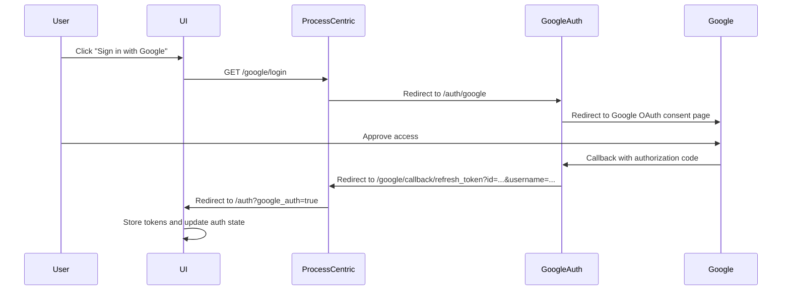

# Google OAuth Implementation Plan

## Overview
Add Google OAuth authentication to the UI using the existing memory process-centric service infrastructure. Users will be able to choose between local authentication (username/password) and Google OAuth.

## Architecture

### Current Flow
```
UI → auth_process_centric (port 8009) → google_auth (port 8004) → Google OAuth
```

### Google OAuth Flow


## Implementation Steps

### 1. Update Auth Types
**File:** [`ui/src/types/auth.ts`](ui/src/types/auth.ts:1)

Add new types for Google OAuth:
- `GoogleAuthResponse` - Response from Google OAuth callback
- `AuthProvider` - Enum for 'local' | 'google'

### 2. Update Auth Service
**File:** [`ui/src/services/auth.ts`](ui/src/services/auth.ts:1)

Add methods:
- `initiateGoogleLogin()` - Initiates Google OAuth flow by redirecting to process-centric service
- `handleGoogleCallback()` - Handles the callback after Google authentication completes
- Update `refresh()` to handle both local and Google refresh tokens

### 3. Update Auth Context
**File:** [`ui/src/contexts/AuthContext.tsx`](ui/src/contexts/AuthContext.tsx:1)

Add:
- `loginWithGoogle()` method to AuthContextType interface
- Implement `loginWithGoogle()` in AuthProvider
- Update token refresh logic to handle Google provider

### 4. Update Auth Page
**File:** [`ui/src/routes/auth.tsx`](ui/src/routes/auth.tsx:1)

Add:
- Google OAuth button with Google branding
- "Or continue with" divider between form and Google button
- Handle Google OAuth callback on page load (check URL params)
- Loading state during Google OAuth flow

### 5. Update Environment Variables
**File:** [`ui/.env`](ui/.env:1)

Add:
- `VITE_AUTH_API_URL` - URL to auth_process_centric service (already exists)
- Ensure CORS is properly configured in process-centric service

## Detailed Changes

### Step 1: Update Auth Types

```typescript
// Add to ui/src/types/auth.ts
export enum AuthProvider {
  LOCAL = 'local',
  GOOGLE = 'google'
}

export interface GoogleAuthResponse {
  id: string
  username: string
  access_token: string
}

export interface AuthUser {
  id: string
  username: string
  provider: AuthProvider
}
```

### Step 2: Update Auth Service

```typescript
// Add to ui/src/services/auth.ts

initiateGoogleLogin(): void {
  // Redirect to process-centric Google login endpoint
  window.location.href = `${API_URL}/google/login`
}

async handleGoogleCallback(): Promise<AuthResponse> {
  // This is called when returning from Google OAuth
  // The process-centric service will set cookies and redirect back
  // We need to verify the token and get user info
  
  const response = await fetch(`${API_URL}/google/verify_token`, {
    method: 'GET',
    credentials: 'include',
    headers: this.getHeaders(),
  })

  const data = await this.handleResponse<AuthResponse>(response)
  
  // Store access token and user data
  this.setAccessToken(data.access_token)
  const userId = getUserIdFromToken(data.access_token) || data.id
  this.setUser({ id: userId, username: data.username })
  
  return data
}
```

### Step 3: Update Auth Context

```typescript
// Add to ui/src/contexts/AuthContext.tsx

interface AuthContextType {
  // ... existing properties
  loginWithGoogle: () => Promise<void>
}

const AuthProvider = ({ children }) => {
  // ... existing code

  const loginWithGoogle = useCallback(async () => {
    try {
      const response = await authService.handleGoogleCallback()
      setUser({ 
        id: response.id, 
        username: response.username,
        provider: AuthProvider.GOOGLE
      })
    } catch (error) {
      setUser(null)
      throw error
    }
  }, [])

  return (
    <AuthContext.Provider
      value={{
        // ... existing values
        loginWithGoogle,
      }}
    >
      {children}
    </AuthContext.Provider>
  )
}
```

### Step 4: Update Auth Page

```typescript
// Add to ui/src/routes/auth.tsx

function Auth() {
  const { isAuthenticated, login, register, loginWithGoogle, isLoading } = useAuth()
  const navigate = useNavigate()
  const [isLoginMode, setIsLoginMode] = useState(true)
  const [username, setUsername] = useState('')
  const [password, setPassword] = useState('')
  const [error, setError] = useState('')
  const [isSubmitting, setIsSubmitting] = useState(false)
  const [isGoogleAuthLoading, setIsGoogleAuthLoading] = useState(false)

  // Check for Google OAuth callback
  useEffect(() => {
    const urlParams = new URLSearchParams(window.location.search)
    const googleAuth = urlParams.get('google_auth')
    
    if (googleAuth === 'true') {
      handleGoogleAuthCallback()
    }
  }, [])

  const handleGoogleAuthCallback = async () => {
    setIsGoogleAuthLoading(true)
    setError('')
    
    try {
      await loginWithGoogle()
      navigate({ to: '/' })
    } catch (err) {
      setError(err instanceof Error ? err.message : 'Google authentication failed')
    } finally {
      setIsGoogleAuthLoading(false)
    }
  }

  const handleGoogleLogin = () => {
    authService.initiateGoogleLogin()
  }

  // ... existing code

  return (
    <div className="flex items-center justify-center min-h-screen bg-gradient-to-br from-blue-100 to-purple-100 p-4">
      <div className="w-full max-w-md p-8 rounded-xl backdrop-blur-md bg-white/50 shadow-xl border border-white/20">
        {/* ... existing header and form ... */}

        {/* Divider */}
        <div className="relative my-6">
          <div className="absolute inset-0 flex items-center">
            <div className="w-full border-t border-gray-300"></div>
          </div>
          <div className="relative flex justify-center text-sm">
            <span className="px-2 bg-white/50 text-gray-500">Or continue with</span>
          </div>
        </div>

        {/* Google OAuth Button */}
        <button
          type="button"
          onClick={handleGoogleLogin}
          disabled={isSubmitting || isGoogleAuthLoading}
          className="w-full flex items-center justify-center gap-3 bg-white text-gray-700 font-semibold py-3 px-6 rounded-lg border border-gray-300 hover:bg-gray-50 transition-all duration-300 shadow-sm hover:shadow-md disabled:opacity-50 disabled:cursor-not-allowed mb-4"
        >
          <svg className="w-5 h-5" viewBox="0 0 24 24">
            <path
              fill="#4285F4"
              d="M22.56 12.25c0-.78-.07-1.53-.2-2.25H12v4.26h5.92c-.26 1.37-1.04 2.53-2.21 3.31v2.77h3.57c2.08-1.92 3.28-4.74 3.28-8.09z"
            />
            <path
              fill="#34A853"
              d="M12 23c2.97 0 5.46-.98 7.28-2.66l-3.57-2.77c-.98.66-2.23 1.06-3.71 1.06-2.86 0-5.29-1.93-6.16-4.53H2.18v2.84C3.99 20.53 7.7 23 12 23z"
            />
            <path
              fill="#FBBC05"
              d="M5.84 14.09c-.22-.66-.35-1.36-.35-2.09s.13-1.43.35-2.09V7.07H2.18C1.43 8.55 1 10.22 1 12s.43 3.45 1.18 4.93l2.85-2.22.81-.62z"
            />
            <path
              fill="#EA4335"
              d="M12 5.38c1.62 0 3.06.56 4.21 1.64l3.15-3.15C17.45 2.09 14.97 1 12 1 7.7 1 3.99 3.47 2.18 7.07l3.66 2.84c.87-2.6 3.3-4.53 6.16-4.53z"
            />
          </svg>
          Sign in with Google
        </button>

        {/* ... existing toggle link ... */}
      </div>
    </div>
  )
}
```

### Step 5: Update Environment Variables

Ensure [`ui/.env`](ui/.env:1) contains:
```env
VITE_AUTH_API_URL=http://localhost:8009
```

The process-centric service at port 8009 already has the Google OAuth endpoints configured.

## Backend Configuration

The backend is already configured with:
- [`authentication/process-centric/main.py`](authentication/process-centric/main.py:205) - `/google/login` endpoint
- [`authentication/process-centric/main.py`](authentication/process-centric/main.py:213) - `/google/callback/refresh_token` endpoint
- [`authentication/process-centric/main.py`](authentication/process-centric/main.py:253) - `/google/verify_token` endpoint
- [`authentication/google/main.py`](authentication/google/main.py:13) - Google OAuth service

CORS is already configured in [`authentication/process-centric/main.py`](authentication/process-centric/main.py:16) to allow requests from `http://localhost:3000`.

## Testing Checklist

- [ ] Click "Sign in with Google" button redirects to Google OAuth page
- [ ] After Google authentication, user is redirected back to auth page
- [ ] Access token is stored in localStorage
- [ ] User is authenticated and redirected to home page
- [ ] Token refresh works for Google-authenticated users
- [ ] Logout works for Google-authenticated users
- [ ] Switching between local and Google authentication works correctly
- [ ] Error handling displays appropriate messages

## Notes

1. The process-centric service handles the OAuth flow and sets HTTP-only cookies for refresh tokens
2. Access tokens are stored in localStorage by the UI
3. The UI verifies Google tokens via the `/google/verify_token` endpoint
4. Both local and Google authentication use the same token refresh mechanism
5. The User object will include a `provider` field to distinguish authentication methods
